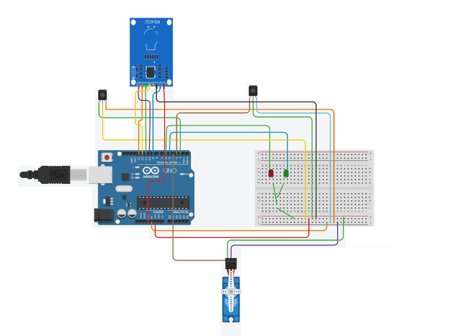

# Vehicle Access Gate Control System using RFID Tag

This project is an Automated Vehicle Access Control System that integrates RFID (Radio-Frequency Identification) technology with IR (Infrared) sensors to manage vehicle access. An Arduino Mega microcontroller orchestrates this efficient system, ideal for parking lots, toll booths, or restricted areas.

## Table of Contents
- [Introduction](#introduction)
- [Features](#features)
- [Components](#components)
- [Circuit Diagram](#circuit-diagram)
- [Flow Path](#flow-path)
- [Installation](#installation)
- [Usage](#usage)
- [Code](#code)
- [Photos](#photos)
- [Contributing](#contributing)
- [License](#license)
- [Acknowledgements](#acknowledgements)

## Introduction
The Automated Vehicle Access Control System uses IR sensors to detect approaching vehicles and verifies their RFID tags. Authorized vehicles are granted access through a servo-controlled gate, and the system logs entry data, including date, time, and vehicle ID. LED indicators provide visual feedback on access status, enhancing security and operational efficiency.

## Features
- RFID-based vehicle identification
- IR sensors for vehicle detection
- Servo motor-controlled gate
- LED indicators for access status
- Data logging for entry events

## Components
- Arduino Mega
- RFID module (MFRC522)
- IR sensors (2)
- Servo motor
- LEDs (Green and Red)
- Resistors
- Jumper wires
- Breadboard

## Flow Path
)

## Circuit Diagram


## Hardware model


## Installation
1. Clone this repository:
    ```sh
    git clone https://github.com/nagakoushik24/Vehical-access-control-system-using-RFID.git
    ```
2. Open the project in Arduino IDE.

3. Install necessary libraries:
    - [MFRC522](https://github.com/miguelbalboa/rfid)
    - Servo (Built-in Arduino library)

## Usage
1. Connect the components as per the circuit diagram.
2. Upload the code to the Arduino Mega.
3. Place the authorized RFID tags near the reader to grant access.
4. Monitor the serial output for status messages.
